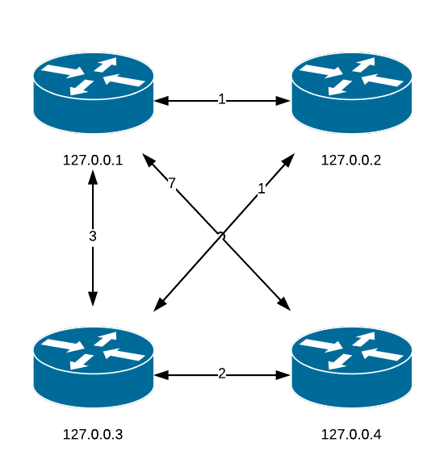
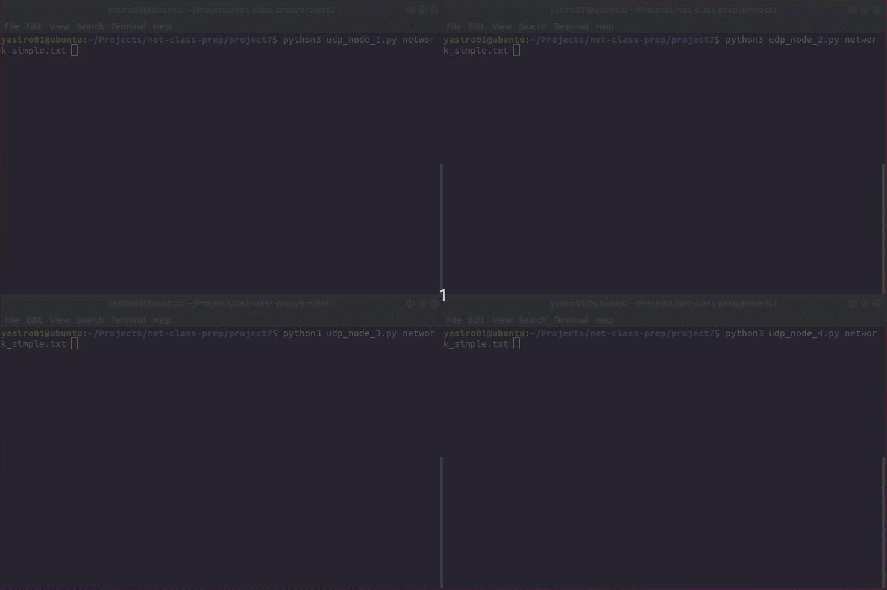

# Simple Web Server

For this project you are going to write a simple web server using Python sockets only (i.e. no Flask, not even http.server). Your server should have the following functionality:

1. Bind to TCP port **4300** on **127.0.0.2** and accept 1 request at a time.
2. Serve a single file, *alice30.txt*.
3. Log details of each incoming request to *webserver.log*.
4. Return *405 Method Not Allowed* error for any method other than *GET*
5. Return *404 Not Found* error for any request other than */alice30.txt*.
6. Send the content of *alice30.txt* to the client along with proper response header.

## Request

A typical request header sent by a browser (Chrome in this case) looks as follows:

```
GET /alice30.txt HTTP/1.1
Host: 127.0.0.2:4300
Connection: keep-alive
Pragma: no-cache
Cache-Control: no-cache
Upgrade-Insecure-Requests: 1
User-Agent: Mozilla/5.0 (X11; Linux x86_64) AppleWebKit/537.36 (KHTML, like Gecko) Chrome/70.0.3538.77 Safari/537.36
Accept: text/html,application/xhtml+xml,application/xml;q=0.9,image/webp,image/apng,*/*;q=0.8
Accept-Encoding: gzip, deflate, br
Accept-Language: en-US,en;q=0.9

```

Use `curl` to initiate a *POST* request and see a 405 error:

```
curl -X POST http://127.0.0.2:4300/alice30.txt
```

## Log

Log file should contain the following information:

1. Time of the request.
2. Requested file.
3. IP address of the client.
4. Browser vendor and version.

```
2018-11-05 09:10:52.906984 | /alice.txt | 127.0.0.1 | Mozilla/5.0 (X11; Linux x86_64) AppleWebKit/537.36 (KHTML, like Gecko) Chrome/70.0.3538.77 Safari/537.36
2018-11-05 09:12:18.072352 | /alice30.txt | 127.0.0.1 | Mozilla/5.0 (X11; Linux x86_64) AppleWebKit/537.36 (KHTML, like Gecko) Chrome/70.0.3538.77 Safari/537.36
2018-11-05 09:15:00.526359 | /alice.txt | 127.0.0.1 | Mozilla/5.0 (X11; Linux x86_64) AppleWebKit/537.36 (KHTML, like Gecko) Chrome/70.0.3538.77 Safari/537.36
2018-11-05 09:21:58.869701 | /alice.txt | 127.0.0.1 | Mozilla/5.0 (X11; Linux x86_64) AppleWebKit/537.36 (KHTML, like Gecko) Chrome/70.0.3538.77 Safari/537.36
2018-11-05 09:22:06.622828 | /alice30.txt | 127.0.0.1 | Mozilla/5.0 (X11; Linux x86_64) AppleWebKit/537.36 (KHTML, like Gecko) Chrome/70.0.3538.77 Safari/537.36
```

## Response

Your server must include the following headers in the response:

1. HTTP version: 1.1
2. Response code: 200 OK
3. `Content-Length`: length of *alice30.txt*.
4. `Content-Type`: plain text (**not** html).
5. `Date`: current date
6. `Last-Modified`: Friday, August 29, 2018 11:00 AM
7. `Server`: must include **your name**

The response header sent by your server should look as follows (date and server are going to be different):

```
HTTP/1.1 200 OK
Content-Length: 148545
Content-Type: text/plain; charset=utf-8
Date: Sun Nov  4 23:25:40 2018
Last-Modified: Wed Aug 29 11:00:00 2018
Server: CS430-ROMAN

```

## References

* [RFC 7231 - Hypertext Transfer Protocol (HTTP/1.1): Semantics and Content](https://tools.ietf.org/html/rfc7231)

* [Request header - MDN Web Docs Glossary: Definitions of Web-related terms | MDN](https://developer.mozilla.org/en-US/docs/Glossary/Request_header)

* [Response header - MDN Web Docs Glossary: Definitions of Web-related terms | MDN](https://developer.mozilla.org/en-US/docs/Glossary/Response_header)

* [Alice's Adventures in Wonderland](www.umich.edu/~umfandsf/other/ebooks/alice30.txt)

# Custom BIND

Complete the following programming project and push code to your GitHub repository.

**Process records of type A (IPv4) or AAAA (IPv6) only. If a client requests anything else, ignore it.**

Use your DNS resolver to initiate requests to the server.

```
python3 nameserver.py zoo.zone
```

1. Read the zone file *zoo.zone* and resolve names found there.

2. Create a UDP socket connection and wait for a message from the DNS resolver.

3. Parse the DNS request.

4. Find the domain in the zone file.

5. Format the response, byte by byte (you may want to use Python's bytearray for that).

6. Return answer(s).

7. Pass all tests provided.

```
python3 -m pytest test_nameserver.py
```

## Approach

* Look at a valid DNS response (eg. ping www.luther.edu and capture the traffic)

* Analyze the structure of a message (see the links below for details) and replicate it

## Functions

### val_to_bytes(value: int, n_bytes: int) -> list

`val_to_bytes` takes an integer and a number of bytes and returns that integer as a list of the specified length. Most fields in DNS response use 2 bytes, but TTL uses 4 bytes. Use shift (<<, >>) and masking (&) to generate the list.

### bytes_to_val(bytes_lst: list) -> int

`bytes_to_val` takes a list of bytes (values 0..255) and returns the value. Most values in DNS use 2 bytes, but you should implement a more generic algorithm to process a list of any length.

### get_left_bits(bytes_lst: list, n_bits: int) -> int

`get_left_bits` takes a 2-byte list and a number *n* and returns leftmost *n* bits of that sequence as an integer.

### get_right_bits(bytes_lst: list, n_bits: int) -> int

`get_right_bits` takes a 2-byte list and a number *n* and returns rightmost *n* bits of that sequence as an integer.

### read_zone_file(filename: str) -> tuple

`read_zone_file` takes file name as a parameter and reads the **zone** from that file. This function builds a dictionary of the following format: `{domain: [(ttl, class, type, address)]}` where each record is a list of tuples (answers). The function should return a tuple of `(origin, zone_dict)`. If the requested domain is not in our zon, `parse_request` should raise a `ValueError`. Note that the records in the zone file may be incomplete (missing a domain name or TTL). The missing domain name should be replaced with the one from the previous line, missing TTL should be replaced with the default one (2nd line of the zone file). If a record contains multiple answers, return them all.

### parse_request(origin: str, msg_req: bytes) -> tuple

`parse_request` takes `origin` and the request bytes and returns a tuple of (transaction id, domain, query type, query). The query is required as it is included in the response. This function must raise `ValueError`s if the type, class, or zone (origin) cannot be processed. Those exceptions are caught in the `run` function.

```
56 f0 01 00 00 01 00 00 00 00 00 00 06 6c 75 74 68 65 72 03 65 64 75 00 00 01 00 01
|---| |---| |---| |---| |---| |---| |------------------| |---------| || |---| |---|
|id | |flags, # of questions etc  | | luther           | | edu     | \0 |typ| |cls|
                                    |------------------query----------------------|
```

### format_response(zone: dict, trans_id: int, qry_name: str, qry_type: int, qry: bytearray) -> bytearray

`format_response` takes the zone dictionary, transaction_id, domain name, and the query. It formats the DNS response (bytearray) based on those values and returns it to the calling function. Your should either *label* or *pointer* to format the domain name.

### run(filename: str) -> None

`run` is the main loop of the server and is implemented for your convenience.

## Resources

* [RFC 1034 - Domain names - concepts and facilities](https://tools.ietf.org/html/rfc1034)

* [RFC 1035 - Domain names - implementation and specification](https://tools.ietf.org/html/rfc1035)

* [The TCP/IP Guide - DNS Messaging and Message, Resource Record and Master File Formats](http://www.tcpipguide.com/free/t_DNSMessagingandMessageResourceRecordandMasterFileF.htm)

* [Chapter 15 DNS Messages](http://www.zytrax.com/books/dns/ch15/)

* [Domain Name System (DNS) Parameters](http://www.iana.org/assignments/dns-parameters/dns-parameters.xhtml)

* [Python Bytes, Bytearray - w3resource](https://www.w3resource.com/python/python-bytes.php)

# Router

## Task

In this project you will be writing a set of procedures to implement a distributed asynchronous distance-vector routing protocol. Eventually we'll try to make all the routers work together in the lab environment. In order to achieve general compatibility, it's mandatory that you use **Ubuntu 18.04** as a platform and **Python 3.6** as the implementation language.

I recommend you implement your router application in stages, from a basic socket application to a full-fledged router.

This is going to be a challenging project, not only in the sense of correctly implementing the distance-vector routing algorithm but also because your program must handle multiple connections that will operate asynchronously. There are several approaches to correctly deal with a bunch of asynchronous sockets, we are going to use the Python `select` method. The `select` method takes three lists, (sockets I want to **read from**, sockets I want to **write to**, sockets that might have **errors**) and checks all of the sockets lists. When the function returns (either right away, or after a set time), the lists you passed in will have been transformed into lists of sockets that you may want to read, write or check for errors respectively. You can be assured that when you make a read or write call, the call will not block.

I would strongly suggest that you take the time to write yourself a high-level design for this project before you start writing code. You may also find it useful to write a little server program that keeps multiple connections active and adds messages to a queue. Doing something very simple like this is a good way to learn and check out the problems you are likely to run into with asynchronous communications before you get mired in the whole distance-vector routing.

Each router should maintain a set of NEIGHBORS (adjacent routers) and a ROUTING_TABLE as a dictionary in the following format:

```
destination: [cost, next_hop]
```

## Stage 1: Read the Configuration File

We start with a simple application that reads a router's configuration from a text file, displays its status (neighbors and cost of getting to them), and starts listening for incoming UDP connections on port 4300. The configuration contains names of your directly connected neighbors and the cost to reach those neighbors.

You should write 4 identical files, each one for a different address (127.0.0.**x**) and port (4300**x**). By the end of the project you should be able to test your routers locally, at the very least.

### Configuration file format

```
Router_1_IP_address
Neighbor_1_IP_addres Cost_of_getting_to_neighbor_1
Neighbor_2_IP_addres Cost_of_getting_to_neighbor_2

Router_2_IP_address
Neighbor_1_IP_addres Cost_of_getting_to_neighbor_1
Neighbor_2_IP_addres Cost_of_getting_to_neighbor_2
Neighbor_3_IP_addres Cost_of_getting_to_neighbor_3
```

File *network_simple.txt* represents the following network:



network_simple.txt
```
127.0.0.1
127.0.0.2 1
127.0.0.3 3
127.0.0.4 7

127.0.0.2
127.0.0.1 1
127.0.0.3 1

127.0.0.3
127.0.0.1 3
127.0.0.2 1
127.0.0.4 2

127.0.0.4
127.0.0.1 7
127.0.0.3 2
```

*TOML* file provides some explanation. **You don't have to read network configuration from TOML config file**.

## Stage 1: Welcome to the Party

Start with a socket application that reads network configuration from a file, binds to port 4300, and prints the routing table.

### Stage 1 Functionality

1. Read the configuration file
2. Pick an appropriate address
3. Display the chosen router's neighborhood (names and costs)
4. Start listening on **UDP** port 4300

## Stage 2: Close Encounters of the Third Kind

1. Your program must connect to the IP addresses specified in the configuration file. Your client should accept a path to the configuration file as a command line argument so that we can try out a couple of different configurations. Note that in order to bootstrap the network you are going to need to have your program retry connections that fail.

2. Your program must also accept incoming IP connections from neighbors which may inform you of a link cost change, or may ask you to deliver a message to a particular IP address.

3. Our protocol will use 3 (three) types of messages: **UPDATE (0)**, **HELLO (1)**, and **STATUS (2)**. The implementation of the first two is required, **STATUS** is optional. You should use `bytearray` or `struct` to format and parse messages.

### UPDATE message format

* The first byte of the message (0): 0

* Next four bytes (1-4): IP address

* The next byte (5): cost

* The same pattern (IP address followed by cost) repeats. 

### HELLO message format

* The first byte of the message (0): 1

* Next four bytes (1-4): source IP address

* Next four bytes (5-8): destination IP address

* The rest of the message (9+): text (characters)

### STATUS message format

* The first byte of the message (0): 2

### Event loop

1. Do we have pending connections?

    1. Accept new connections

    2. Add to the listener list

    3. Add IP addresses to the neighbor list

2. Process incoming messages

    1. If UPDATE, then update the routing table
        * Does my vector change?  If so, then set flag to `update_vector`
        * Print the updated routing table

    2. If DELIVERY, then forward to the destination

    3. If STATUS, then respond with the routing table

3. Is `update_vector` flag set?

    1. Send the new vector to all neighbors that can accept data

4. Check my neighbor list against the list of currently connected neighbors

    1. If missing neighbors, then try to initiate connections to them

    2. If successful, then add the new neighbor to list

    3. Send the new neighbor my distance vector

### Stage 2 Functionality

1. Read the configuration file name as a command line parameter
2. Read the neighborhood information from the configuration file
3. Send a router's table to all neighbors
4. Receive updates from the neighbors
5. Keep listening and be ready to update the routing table

## Stage 3: Routing

Write the following routing functions.

* Read a configuration file for your specific router and add each neighbor to a set of neighbors.

* Build an initial routing table as a dictionary with nodes as keys. Dictionary values should be a distance to the node and the next hop address. Initially, the dictionary must contain your neighbors only.

```python
{'destination':[cost, 'next_hop']}
```

* Format the update message based on the values in the routing table and return the message. For example, a message advertising routes to **127.0.0.1** of cost **10** and to **127.0.0.2** of cost **5** is the following `bytearray`:

```
0x0 0x7f 0x0 0x0 0x1 0xA 0x7f 0x0 0x0 0x2 0x5
```

* Parse the update message and return `True` if the table has been updated. The function must take a message (raw bytes) and the neighbor's address and update the routing table, if necessary.

* Print current routing table. The function must print the current routing table in a human-readable format (rows, columns, spacing).

* Parse a message to deliver. The function must parse the message and extract the destination address. Look up the destination address in the routing table and return the next hop address.

* Router works with properly implemented routers of other students.

## Functions

### read_file(filename)

* Read a configuration file for your specific router and add each neighbor to a set of neighbors.
* Build an initial routing table as a dictionary with nodes as keys.
* Dictionary values should be a distance to the node and the next hop address (ie. {'destination':[cost, 'next_hop']}).
* Initially, the dictionary must contain your neighbors only.

### format_update_msg()

* Format the update message based on the values in the routing table.
* The message advertising routes to 127.0.0.1 of cost 10 and to 127.0.0.2 of cost 5 is a bytearray in the following format
```
0x0 0x7f 0x0 0x0 0x1 0xA 0x7f 0x0 0x0 0x2 0x5
```
* The function must return the message.

### update_table(msg, neigh_addr)

* Parse the update message.
* The function must take a message (raw bytes) and the neighbor's address and update the routing table, if necessary.
* The function must return True if the table has been updated.

### print_status()

* Print current routing table.
* The function must print the current routing table in a human-readable format (rows, columns, spacing).

### deliver_msg()

* Parse a message to deliver.
* The function must parse the message and extract the destination address.
* Look up the destination address in the routing table and return the next hop address.

### send_update(node)

* Send updated routing table to the specified node (router)

## Running the simulation

Start each router as follows:

```
python3 router_1.py network_simple.txt
python3 router_1.py network_simple.txt
python3 router_1.py network_simple.txt
python3 router_1.py network_simple.txt
```



## References

* [socket — Low-level networking interface — Python 3.7.1 documentation](https://docs.python.org/3/library/socket.html)
* [select — Waiting for I/O completion — Python 3.7.1 documentation](https://docs.python.org/3/library/select.html)

* [toml-lang/toml: Tom's Obvious, Minimal Language](https://github.com/toml-lang/toml)

